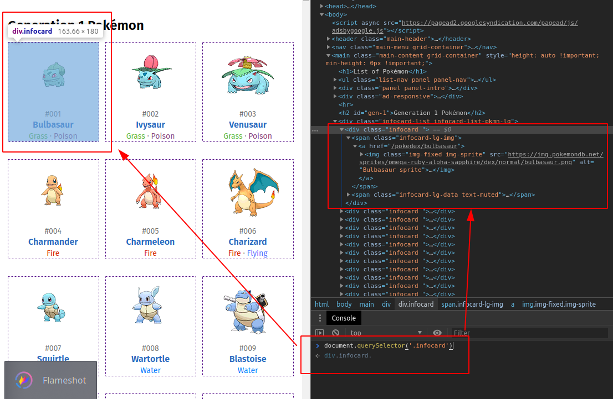

# :shinto_shrine: - Bichomon #

## Introducción ##

Érase una vez, hace mucho, mucho tiempo, en un mundo donde no existían animales, donde todos trabajaban de lo mismo, y el que no estaría escondido, te encargaron hacer una versión 0.1 de la `bichodex`.

## Requisitos ##

- HTML

- Javascript

- Javascript DOM API

## Iteraciones ##

Te proveemos de una página con su html, css y js. Este último donde habrás de hacer tus "experimentos". No escribirás nada en la página de CSS.

Podrás usar la consola para ver, de manera inmediata, si el resultado de tu código es el deseado.

Aquí hemos ejecutado `document.querySelector('.infocard')` para obtener el primer elemento de todos los que coincidan con dicha ejecución.

Una vez lo tenemos, podemos interactuar con él y obtener la información que nos interese, para poder transformarla o mostrarla tal cual.

1. Cambia el título "Generation 1 Pokémon" por "Generasión 1 Pokimon".

2. Cambia el color de fondo de la primera generación de Pokimon.

3. Imprime por consola la URL de la página.

4. Imprime por consola el dominio de la página.

5. Imprime todos los nodos de imagen.

6. Sustituye el atributo "src" de todas las imágenes por este "https://media.giphy.com/media/2v170e71aanfi/giphy.gif"

*Premium:*

7. Cambia el fondo de todos los `infocard-lg-data text-muted` para todos los Pokimon voladores `itype flying`
